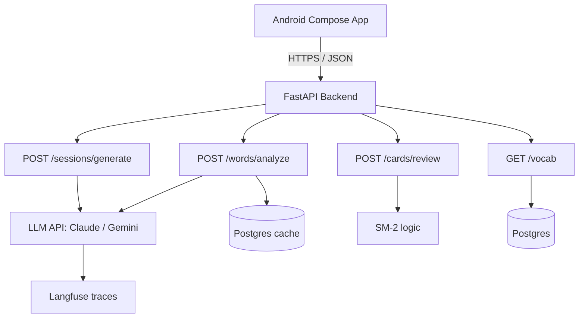

# Hebrew Learning App — MVP Plan

## О проекте

Mobile-first инструмент для изучения иврит-лексики через персонализированный AI-сгенерированный контент. Решает проблему разрыва между active vocabulary из карточек/занятий и passive comprehension в живой речи: вместо того чтобы заставлять пользователя читать сложные иврит-тексты в дикой природе, приложение генерирует тексты ровно на его уровне и учит на них.

**Целевой пользователь:** русскоязычный изучающий иврит на уровне A2–B1, застрявший между карточками и реальным контентом.

**Killer-фича:** spaced repetition без decontextualized карточек — каждый review показывает слово в новом LLM-сгенерированном предложении.

**Срок:** 4 недели, 25–30 часов в неделю.

---

## Технологический стек

### Mobile (Android)

- Kotlin + Jetpack Compose
- MVVM, ViewModel + StateFlow, Hilt для DI
- Retrofit + Kotlinx Serialization
- Room (словарь, история сессий), DataStore (prefs)
- Anonymous user_id для MVP, нормальный auth — в v2

### Backend

- FastAPI + Python 3.11+
- PostgreSQL, JSONB для гибких структур
- SQLAlchemy + Alembic
- Pydantic для structured output из LLM с retry-логикой

### LLM-стек

- **Claude Sonnet 4.6** — primary candidate для генерации и анализа
- **Gemini 2.5 Pro** — для бенчмарка, потенциальный переход на иврит-задачах
- **DictaLM / AlephBERT** — fallback на морфологию, если eval покажет проблемы у LLM
- Агрессивный кеш разборов слов в Postgres — cost engineering

### Eval-инфраструктура

- Pytest + golden dataset (30–50 примеров)
- LLM-as-judge с ручной калибровкой
- Langfuse self-hosted для tracing, cost, latency
- A/B-фреймворк для сравнения моделей в pytest

### Деплой

- Backend: VPS + Caddy + Docker Compose
- Postgres: на той же машине в Docker
- Mobile: Firebase App Distribution для раздачи APK
- CI/CD: GitHub Actions

---

## Архитектура

---

## Что НЕ входит в MVP (анти-скоуп)

Отдельно фиксирую, чтобы не было соблазна расширить:

- iOS / KMP
- Voice / TTS / STT
- Голосовая разговорная практика
- VLM / OCR / камера для распознавания иврит-текста в реальном мире
- Нормальный auth (OAuth, профили)
- Импорт колод из Anki — ручной ввод базового словаря или оценка уровня
- Push-уведомления о daily review
- Многопользовательский режим, sharing
- Веб-клиент

---

## План на 4 недели

### Неделя 1 — фундамент и первая генерация

**Цель:** в Android-приложении нажимаешь кнопку — на экране появляется сгенерированный иврит-текст.

- [x] **Дни 1–2:** Backend skeleton — FastAPI, Postgres в Docker, базовые модели, anonymous user_id, .env, базовый деплой на VPS
- [x] **Дни 2–3:** Первый LLM-вызов — генерация иврит-текста с констрейнтами (уровень + тема + целевые слова) через Pydantic structured output
- [x] **Дни 3–4:** Android skeleton — Compose, навигация, один экран
- [x] **День 5:** Соединение — кнопка → API → текст на экране с RTL-рендером
- [ ] **Дни 6–7:** Первая версия eval — 5–10 ручных примеров, LLM-as-judge с критериями (уровень / грамматика / использование целевых слов)

**Артефакт недели:** видео 30 секунд — нажал, получил иврит-текст на экране.

---

### Неделя 2 — чтение и разбор слов

**Цель:** тап на слово в тексте → перевод, корень, биньян, родственные слова. Сохранение в персональный словарь.

- [ ] **Дни 8–9:** Endpoint анализа слова — вход (слово + предложение), выход structured (лемма, корень, биньян/мишкаль, контекстный перевод, 2–3 родственных)
- [ ] **Дни 9–10:** Postgres caching разборов по ключу `word+context_hash` — это первый cost-engineering story для интервью
- [ ] **Дни 10–11:** Reading screen на Android — RTL-текст, тап триггерит lookup, bottom sheet с разбором
- [ ] **Дни 12–13:** Кнопка «выучить» добавляет слово в пул со статусом `learning`
- [ ] **Дни 13–14:** Расширение eval до 20+ слов с ручной проверкой, LLM-as-judge на качество разбора

**Артефакт недели:** видео — читаешь текст, тапаешь незнакомое, копишь словарь.

---

### Неделя 3 — spaced repetition и контекстный review

**Цель:** ежедневный review, каждое слово показывается в свежем LLM-сгенерированном предложении.

- [ ] **Дни 15–16:** SM-2 в backend — таблица карточек (`ease`, `interval`, `due_date`, `last_review`)
- [ ] **Дни 16–17:** Endpoint «карточки на сегодня», Android review screen — иврит-предложение, тап показывает перевод, оценка 1–5
- [ ] **Дни 18–19:** **Killer-флоу** — для каждого review генерируется новое предложение с этим словом, не decontextualized карточка. Это та фича, ради которой проект существует
- [ ] **Дни 20–21:** Stats screen — `known` / `learning` / `mastered`, streak

**Артефакт недели:** видео полного дневного флоу — прочитал текст, сохранил слова, на следующий день ревьюишь их в новых контекстах.

---

### Неделя 4 — observability, бенчмарк, polish, документация

**Цель:** проект, который защищается на собеседовании.

- [ ] **Дни 22–23:** Langfuse в Docker, инструментирование всех LLM-вызовов, дашборд cost / latency / quality
- [ ] **Дни 23–24:** Полная eval-сюита в GitHub Actions, бенчмарк Claude vs Gemini на одном golden set, результаты в таблицу
- [ ] **День 25:** Onboarding flow — выбор уровня, тем, опциональный стартовый словарь
- [ ] **Дни 26–27:** UI polish (без перфекционизма — читаемо и работает), error handling, retry-логика на LLM-вызовы
- [ ] **День 28:** Production deploy на VPS, сборка release APK
- [ ] **Дни 29–30:** README с архитектурной диаграммой, eval-результаты writeup, 2-минутное демо-видео

**Артефакт недели:** публичный GitHub-репо, deployed backend, ссылка на APK, демо-видео, eval-дашборд скриншоты, написанный README.

---

## Cut list (если отстаёшь)

В порядке вырезания:

1. Onboarding flow → захардкодить уровень и темы для демо
2. Stats screen → cut целиком
3. UI polish → minimum viable, некрасиво но работает
4. Бенчмарк двух моделей → выбрать одну заранее, бенчмарк описать в README как next step

**НЕ вырезать ни при каком сценарии:**

- Eval-сюиту
- Langfuse observability
- Демо-видео
- README с архитектурной диаграммой

Это interview-mass, остальное — обвязка.

---

## Главные риски

| Риск                                            | Когда узнаешь       | Митигация                                                                                           |
| ----------------------------------------------- | ------------------- | --------------------------------------------------------------------------------------------------- |
| Качество иврита у LLM в констрейн-генерации     | Конец недели 1      | DictaLM для морфологии, большая модель только для generation                                        |
| Compose + RTL + tap-on-word — гранёные кейсы    | Неделя 2            | Запасной день на отладку, не строить на этом критичную логику                                       |
| Constraint-following в генерации (LLM халтурит) | Неделя 1, всё время | Eval ловит, retry-логика корректирует, промпты итеративно улучшаются                                |
| Стоимость LLM-вызовов растёт быстрее ожиданий   | Начиная с недели 2  | Aggressive caching, дашборд стоимости в Langfuse, fallback на меньшую модель для не-критичных задач |

---

## Demo-артефакты по неделям

| Неделя | Артефакт                                                   | Куда выложить                |
| ------ | ---------------------------------------------------------- | ---------------------------- |
| 1      | Видео 30с: кнопка → иврит-текст на экране                  | LinkedIn, Telegram           |
| 2      | Видео: чтение текста с тапами на слова, накопление словаря | LinkedIn                     |
| 3      | Видео полного дневного флоу: чтение + review               | LinkedIn                     |
| 4      | Публичный репо + APK + демо-видео + README + eval-дашборд  | LinkedIn, CV, портфолио-сайт |

---

## Параллельный маркетинг себя как кандидата

Контент-план для LinkedIn-постов в конце каждой недели — это часть проекта, не отдельная задача:

- **Конец недели 1:** «Начал работу над AI-инструментом для изучения иврит-лексики. Constraint-driven LLM generation + персонализация под уровень пользователя. Stack: FastAPI / Compose / Claude / Gemini. Первый драфт eval-сюиты на 10 примеров.»
- **Конец недели 2:** «Реализовал морфологический анализ иврит-слов через structured output LLM с Pydantic-валидацией. Postgres caching сократил повторные вызовы — стоимость второго разбора того же слова падает до нуля.»
- **Конец недели 3:** «Killer-фича: spaced repetition с LLM-сгенерированными контекстными предложениями. Ни одной decontextualized карточки в системе.»
- **Конец недели 4:** «MVP готов: [демо-видео], [github], [APK]. Бенчмарк Claude vs Gemini на иврит-генерации — writeup в репо. Открыт к разговору про AI engineering позиции.»

---

## Definition of Done для MVP

Проект считается завершённым, когда выполнены ВСЕ пункты:

- [ ] Публичный GitHub-репо с README, архитектурной диаграммой, описанием стека и eval-результатов
- [ ] Backend задеплоен и доступен по HTTPS
- [ ] APK собран и доступен через Firebase App Distribution
- [ ] Демо-видео на 2 минуты, показывающее полный флоу
- [ ] Eval-сюита запускается в GitHub Actions и проходит
- [ ] Langfuse-дашборд работает, показывает метрики хотя бы за 7 дней
- [ ] Я сам пользовался приложением минимум 14 дней и могу честно сказать «выучил X слов»

Последний пункт — главный. Если ты сам не используешь — никакая защита на интервью не спасёт.
